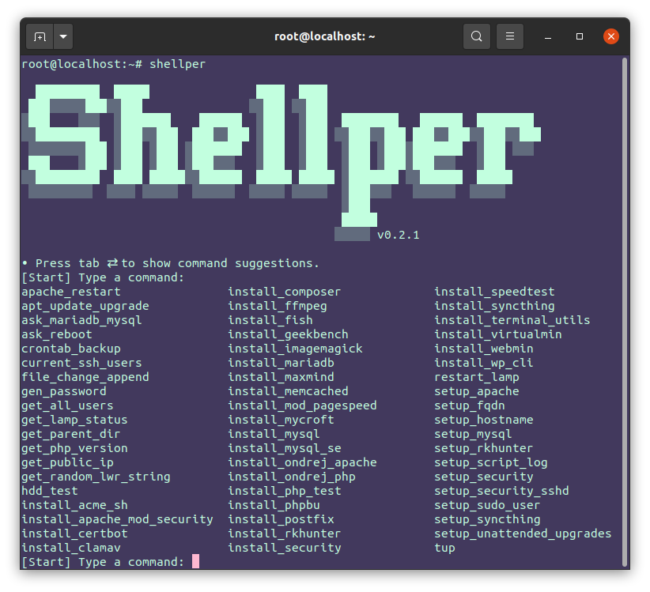

# Shellper

Another DevOps tool box.

- [Shellper](#shellper)
  - [Features](#features)
  - [Tested](#tested)
  - [Install](#install)
  - [Uninstall](#uninstall)
  - [Use](#use)
    - [Run](#run)
    - [Include](#include)
  - [Examples](#examples)
    - [Quick LAMP install-lamp.sh](#quick-lamp-install-lampsh)
  - [Support](#support)
  - [Funding](#funding)
  - [License](#license)

[](https://www.youtube.com/watch?v=RiqMoP9DCSU)

## Features

- Simple single file script
- Time saving auto-complete commands via `rlwrap`
- Run local or install globally

## Tested

| Shellper | Distribution | Version       | Comments                         |
| -------- | ------------ | ------------- | -------------------------------- |
| `main`   | Ubuntu       | `20.04.2 LTS` |                                  |
| `0.2.1`  | Debian       | `10`          | Unattended upgrades, missing UFW |


## Install

One line install.

```bash
wget -O - https://raw.githubusercontent.com/carmelosantana/shellper/master/install.sh | sudo bash
```

---

Alternatively you can clone the repository and run Shellper locally.

```bash
git clone https://github.com/carmelosantana/shellper.git shellper
cd "shellper"
chmod +x shellper.sh
```

## Uninstall

1. [`rlwrap`](https://github.com/hanslub42/rlwrap) is the only dependency installed by [install.sh](install.sh). Uninstall with:

    ```bash
    sudo apt remove rlwrap
    ```

2. The installer copies a single script. This can easily be removed with:

    ```bash
    sudo rm /usr/local/bin/shellper
    ```

## Use

### Run

1. Run global

    ```bash
    shellper
    ```

    or local script

    ```bash
    ./shellper.sh
    ```

2. Start typing a command.

    > If installed via [install.sh](install.sh) `rlwrap` will provide auto-complete.

### Include

You can also include Shellper into your existing scripts or build entirely new scripts with just Shellper functions.

You can invoke the installer and include Shellper on the fly.

## Examples

### Quick LAMP [install-lamp.sh](examples/install-lamp.sh)

Provisions a performance oriented PHP web server with the following:

- Update system
- Add [Ondřej Surý](https://launchpad.net/~ondrej/+archive/ubuntu/php/) PPA for latest stable releases
- Apache
  - Enables `mod_event`
- PHP
- PHP-FPM
- Prompts the user to select MariaDB or MySQL
- memcached
- Postfix

## Support

⭐ [Contact](https://github.com/carmelosantana/) for commercial support.

## Funding

If you find this project useful or use it in a commercial environment please consider donating today with one of the following options.

- [PayPal](https://www.paypal.com/donate?hosted_button_id=5RKFT8CT6DAVE)
- Bitcoin `bc1qhxu9yf9g5jkazy6h4ux6c2apakfr90g2rkwu45`
- Ethereum `0x9f5D6dd018758891668BF2AC547D38515140460f`
- Tron `TFw3D8UwduZJvx8J4FPPgPVZ2PPJfyXs3k`

## License

The code is licensed [MIT](https://opensource.org/licenses/MIT) and the documentation is licensed [CC BY-SA 4.0](https://creativecommons.org/licenses/by-sa/4.0/).
